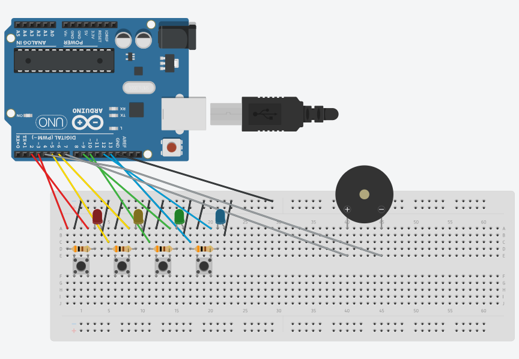
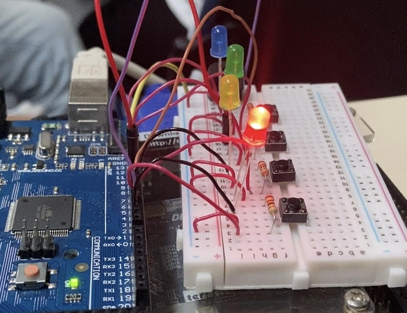

# Genius-Arduino
Projeto realizado para a disciplina '[SSC0180] – Eletrônica para Computação', ministrada pelo professor Eduardo do Valle Simões. Neste projeto, desenvolvemos uma aplicação similar ao dispositivo de repetição/memorização de sequência de cores "Genius" com Arduino. Projeto baseado no código-fonte do [pontocomdev](https://github.com/pontocomdev/genius_arduino).

# Integrantes - Grupo 17

| **Nome**              | **N°USP**|
|--------------------------------|----------|
| Bruna Izabel da Silva Pereira| 15635441 | 
| Camilli Gabrielli Ramos Muniz| 15635722 |
| [Laura Fernandes Camargos](https://github.com/laurafcamargos)| 13692334 |
| [Sandy da Costa Dutra](https://github.com/sandycdutra)| 12544570 |

# Objetivo
Reproduzir o jogo "Genius" com Arduíno.

# Esquema no Tinkercad
>  

# Jogo na protoboard
>  

